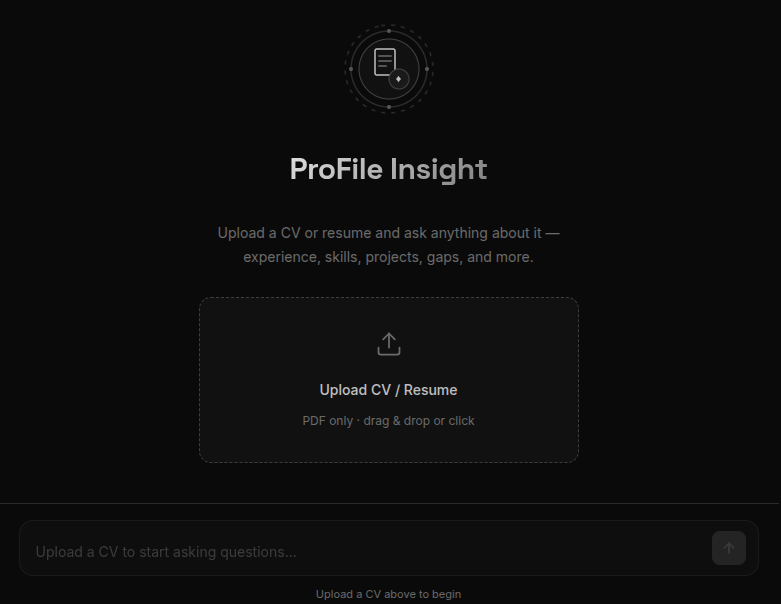

# ProFile Insight



**ProFile Insight** is a CV chat assistant. Upload a resume as a PDF, then ask questions in everyday language — the app reads the document and answers based only on what's actually in it.

Whether you're a recruiter screening candidates, a hiring manager preparing for an interview, or someone reviewing your own resume, ProFile Insight helps you pull out skills, experience, projects, and qualifications without scrolling through pages manually.

**Live app:** [ProFile Insight](https://profileinsight.up.railway.app/)

---

## Features

- **PDF upload** — Drag and drop or click to upload any CV/resume (PDF only)
- **Natural-language Q&A** — Ask anything about the document; no special format needed
- **Smart formatting** — Answers come back as bullet lists or short paragraphs, depending on the question
- **Source pages** — See which pages of the CV each answer was drawn from
- **Suggested questions** — Quick-start prompts like “What are the key skills?” or “Summarise work experience”
- **Grounded responses** — Answers use only the uploaded CV; if something isn't there, the app says so
- **Clean chat UI** — Simple, focused interface with a status bar showing when your CV is ready

---

## Example questions

- What are the candidate's key skills?
- Summarise their work experience
- List all projects mentioned in the CV
- What is their highest qualification?
- How many years of experience do they have?
- Which technologies or tools are listed?

---

## How it works

1. Upload your CV as a PDF
2. The app reads and indexes the document
3. Ask a question in the chat box
4. Get a structured answer with page references

Your PDF is processed for the session and not kept on disk after indexing. Each conversation is tied to the CV you uploaded in that session.

---

## Setup & run locally

### Prerequisites

- Python 3.11+
- [Voyage AI](https://www.voyageai.com/) API key (embeddings)
- [Anthropic](https://www.anthropic.com/) API key (Claude)

### Steps

1. **Clone the repo**

   ```bash
   git clone https://github.com/ManzoorAhmedShaikh/ProFile-Insight.git
   cd ProFile-Insight
   ```

2. **Create a virtual environment**

   ```bash
   python -m venv .venv
   source .venv/bin/activate   # Windows: .venv\Scripts\activate
   ```

3. **Install dependencies**

   ```bash
   pip install -r requirements.txt
   ```

4. **Configure environment variables**

   Copy the example file and add your keys:

   ```bash
   cp .env.example .env
   ```

   Edit `.env`:

   ```env
   EMBEDDINGS_KEY=your_voyage_key_here
   ANTHROPIC_KEY=your_anthropic_key_here
   ```

5. **Run the app**

   ```bash
   uvicorn main:app --reload
   ```

   Open [http://127.0.0.1:8000](http://127.0.0.1:8000) in your browser.

---

## Contributing & bugs

Found a bug or have an idea to improve ProFile Insight? Open an issue or submit a pull request — contributions are welcome.
